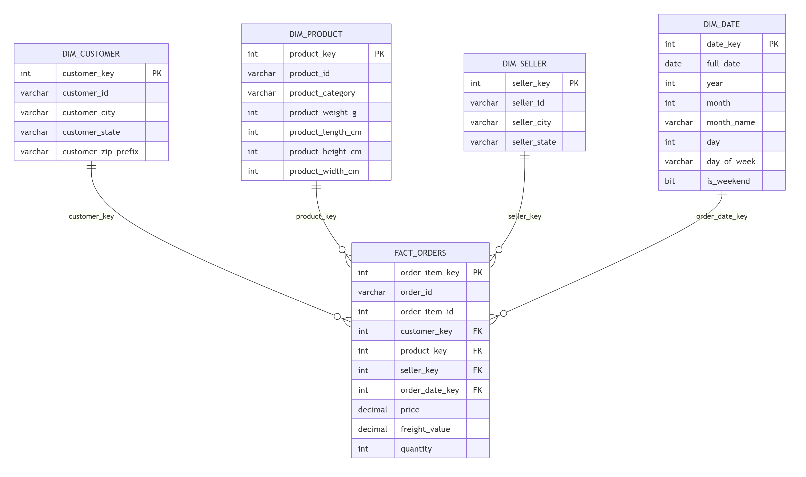

# E-Commerce Dimensional Data Warehouse on Azure SQL Database

A properly modeled star schema data warehouse for e-commerce transaction data — fact and dimension tables, surrogate keys, foreign key relationships, and indexing designed around how a BI tool actually queries the data. Built as a companion to my batch and streaming pipeline projects, this one focuses on data modeling rather than orchestration.



---

## 📌 Problem Statement

<!-- Edit to match your framing, example: -->
Flat, denormalized files are fine for ad-hoc querying, but BI tools and analysts work best against a properly modeled relational schema — one where relationships are explicit, keys are indexed, and the same dimension (like customer or product) isn't duplicated across every row. This project takes the Olist e-commerce dataset and models it as a **star schema**: a central fact table of order line items, surrounded by clean dimension tables for customers, products, sellers, and dates — the same pattern used in production data warehouses.

---

## 🏗️ Architecture / Data Model

```
                dim_customer
                     |
dim_seller ---- fact_orders ---- dim_product
                     |
                  dim_date
```

**Fact table:** `fact_orders` — one row per order line item, with foreign keys to every dimension and the core measures (price, freight value, quantity).

**Dimension tables:**
- `dim_customer` — customer location details
- `dim_product` — product category and physical attributes
- `dim_seller` — seller location details
- `dim_date` — a standard date dimension (year, month, day, weekday, is_weekend)

**Why a star schema:** it's the standard pattern for analytical workloads — denormalized enough for fast aggregation, but structured enough for BI tools like Power BI to auto-detect relationships and build a working semantic model without manual joins in every query.

---

## 🛠️ Tech Stack

| Component | Purpose |
|---|---|
| **Azure SQL Database (Basic tier)** | Hosts the star schema — a real relational database rather than query-in-place over files |
| **Python (pandas + SQLAlchemy)** | Extracts, reshapes, and loads source CSVs into the dimensional model |
| **T-SQL** | Schema DDL, surrogate key design, indexing, and analytical queries |
| **Power BI Desktop** | Connects directly to the database; auto-detects relationships from foreign keys for a native semantic model |

**Why Azure SQL Database instead of Synapse serverless here:** Serverless SQL is excellent for querying files in place, but it doesn't support indexes, enforced foreign keys, or persistent tables. This project intentionally uses a real database to demonstrate schema design and load — a different (and complementary) skill from the query-in-place approach in my [batch pipeline project](../azure-ecommerce-analytics-pipeline).

---

## 📊 Example Analytical Queries

*(Full set: [`sql/analysis_queries.sql`](./sql/analysis_queries.sql))*

- Revenue and order volume by product category
- Monthly revenue trend across the full date range
- Revenue by customer state

<!-- Add 1-2 real findings here once you've run the queries, e.g.: -->
- The top 3 product categories account for **[X]%** of total revenue.
- **[State]** leads in both order volume and revenue, consistent with population/e-commerce penetration patterns.

---

## 📈 Dashboard


Built directly on the star schema in Power BI's **Import** mode, with relationships auto-detected from the database's foreign keys rather than manually joined in Power Query — a direct benefit of the dimensional model over flat-file querying.

*(Full report: [`dashboard/ecommerce_dw_dashboard.pdf`](./dashboard/ecommerce_dw_dashboard.pdf))*

---

## 🔁 How to Reproduce

1. **Provision Azure SQL Database** — create a logical SQL server and a Basic-tier database (commands in the project write-up, or adapt [`sql/create_schema.sql`](./sql/create_schema.sql) after provisioning).
2. **Create the schema** — run [`sql/create_schema.sql`](./sql/create_schema.sql) against the new database to create all fact/dimension tables, keys, and indexes.
3. **Download the source data** — [Olist Brazilian E-Commerce dataset](https://www.kaggle.com/datasets/olistbr/brazilian-ecommerce) (not included in this repo).
4. **Load the warehouse** — run the load script:
   ```bash
   pip install pandas sqlalchemy pyodbc
   python scripts/load_dw.py
   ```
   (Update the connection details at the top of the script, or better — set them as environment variables before running.)
5. **Explore** — run the queries in [`sql/analysis_queries.sql`](./sql/analysis_queries.sql) to validate the load and explore the data.
6. **Connect Power BI** — Get Data → Azure SQL Database → point at your server/database → import all 5 tables → verify relationships in Model view.

---

## 📂 Repo Structure

```
azure-ecommerce-dimensional-warehouse/
├── README.md
├── architecture-diagram.png
├── sql/
│   ├── create_schema.sql
│   └── analysis_queries.sql
├── scripts/
│   └── load_dw.py
└── dashboard/
    ├── ecommerce_dw_dashboard.pdf
    └── screenshots/
```

---

## 💡 What I'd Do Differently at Scale

- Implement **slowly changing dimensions (SCD Type 2)** for `dim_customer`/`dim_product` to track historical changes rather than overwriting attributes.
- Move the load process into **Azure Data Factory** with incremental loading via watermark columns, instead of a one-shot Python script.
- Partition `fact_orders` by date range once volume grows beyond what a single table handles efficiently.
- Add **automated data quality checks** (row count reconciliation, null checks on keys) as part of the load process.
- Consider **Synapse dedicated SQL pool** or a columnstore index on `fact_orders` if query performance became a concern at larger scale.

---

## 🔗 Related Projects

- **[Azure E-Commerce Analytics Pipeline](../azure-ecommerce-analytics-pipeline)** — batch ETL with ADF and Synapse serverless SQL
- **[Azure E-Commerce Streaming Pipeline](../azure-ecommerce-streaming-pipeline)** — real-time ingestion with Event Hubs and Stream Analytics

---

## 🧾 License

<!-- Add if relevant -->
